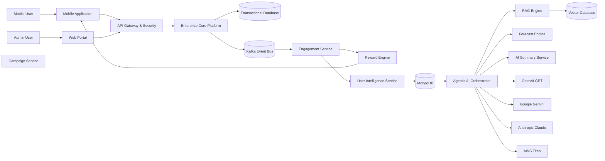
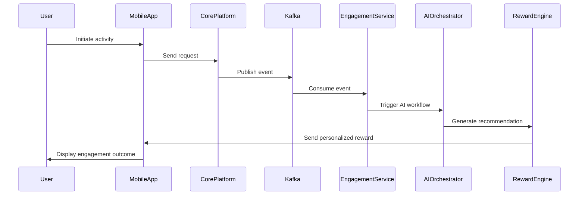
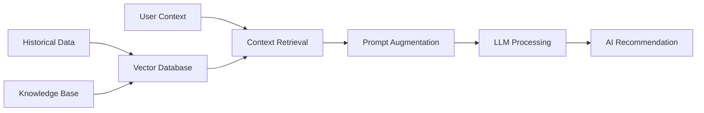

# enterprise-agentic-ai-platform
Reference architecture for enterprise Agentic AI systems integrating RAG, multi-agent orchestration, Kafka streaming, AI personalization, and cloud-native microservices.
# 🚀 Enterprise Agentic AI Platform

> AI-Powered Enterprise Engagement & Intelligent Automation Platform

---

# 📌 Overview

Enterprise-scale Agentic AI platform designed for intelligent user engagement, AI-driven personalization, forecasting, and autonomous decision orchestration using modern cloud-native architecture.

The platform combines:

- Agentic AI
- Multi-Agent Systems (MAS)
- RAG (Retrieval-Augmented Generation)
- Kafka event streaming
- Enterprise microservices
- AI personalization
- Predictive analytics
- AI governance & security

This architecture demonstrates how enterprise systems can leverage AI to deliver:

- Personalized experiences
- Intelligent rewards
- Forecast-driven campaigns
- Context-aware automation
- Real-time event orchestration
- AI-powered operational insights

---

# 🧠 Core Capabilities

## ✅ AI Personalization Engine
- User behavior analysis
- Personalized recommendations
- Engagement scoring
- Intelligent reward optimization

---

## ✅ Multi-Agent AI Orchestration
The platform uses multiple AI agents for:

- Forecast generation
- User behavior analysis
- Recommendation generation
- Reward optimization
- AI summarization
- Intelligent decision workflows

---

## ✅ Real-Time Event Processing
Kafka-based streaming architecture for:

- Transaction events
- User activity
- Reward events
- AI workflow triggers
- Forecast events

---

## ✅ AI Forecasting
Predictive AI services generate:

- User growth predictions
- Engagement forecasts
- Intelligent targeting recommendations
- Future activity analysis

---

## ✅ RAG-Based AI Intelligence
RAG architecture enables:

- Context-aware AI responses
- Historical activity analysis
- Personalized AI insights
- Enterprise knowledge retrieval

---

# 🏗 High-Level Architecture



---

# 🔄 User Engagement Flow



---

# 🤖 AI Agent Architecture

| AI Agent | Responsibility |
|---|---|
| User Behavior Agent | Analyze user activity & trends |
| Forecast Agent | Predict growth & engagement |
| Reward Optimization Agent | Intelligent reward selection |
| Campaign Recommendation Agent | Personalized targeting |
| AI Summary Agent | Generate business insights |

---

# 📊 Data Intelligence Layer

MongoDB stores:

- User activity history
- Engagement metrics
- Personalized preferences
- Forecasted values
- AI-generated summaries
- Behavioral insights

---

# ⚡ Kafka Event Streaming

Kafka topics include:

```text
user.activity.events
engagement.events
reward.events
forecast.events
ai.workflow.events
```

Benefits:

- Real-time scalability
- Event replay capability
- Loose coupling
- High throughput processing
- AI-triggered workflows

---

# 🧠 RAG Workflow



---

# 🔐 Security & Governance

Enterprise-grade controls include:

- OAuth2
- JWT Authentication
- RBAC
- mTLS
- Audit logging
- AI governance
- Prompt validation
- Secure API gateway
- Role-based authorization

---

# ☁ Technology Stack

## Backend
- Java
- Spring Boot
- Kafka
- REST APIs

## AI Stack
- LangGraph
- RAG
- GPT
- Gemini
- Claude
- Titan

## Databases
- MongoDB
- PostgreSQL

## Cloud & Infra
- AWS
- Docker
- Kubernetes

## Observability
- ELK Stack
- Kibana
- Prometheus

---

# 📈 Business Benefits

- AI-driven personalization
- Intelligent engagement
- Real-time automation
- Predictive recommendations
- Improved user retention
- AI-assisted operations
- Scalable event-driven architecture

---

# 🔮 Future Enhancements

- Reinforcement learning engine
- AI anomaly detection
- Conversational AI assistant
- Voice AI workflows
- Autonomous campaign optimization
- AI explainability dashboards

---

# 👨‍💻 About

Technical Product Owner with enterprise experience in:

- AI Platforms
- Agentic AI
- RAG Architectures
- Event-Driven Systems
- Enterprise Payments
- Cloud-Native Microservices
- AI Governance & Security

---

# ⭐ Vision

Building secure, scalable, and intelligent enterprise AI systems that combine:

- Human intelligence
- Multi-agent orchestration
- Predictive analytics
- Context-aware AI
- Real-time automation
- Enterprise-grade governance
