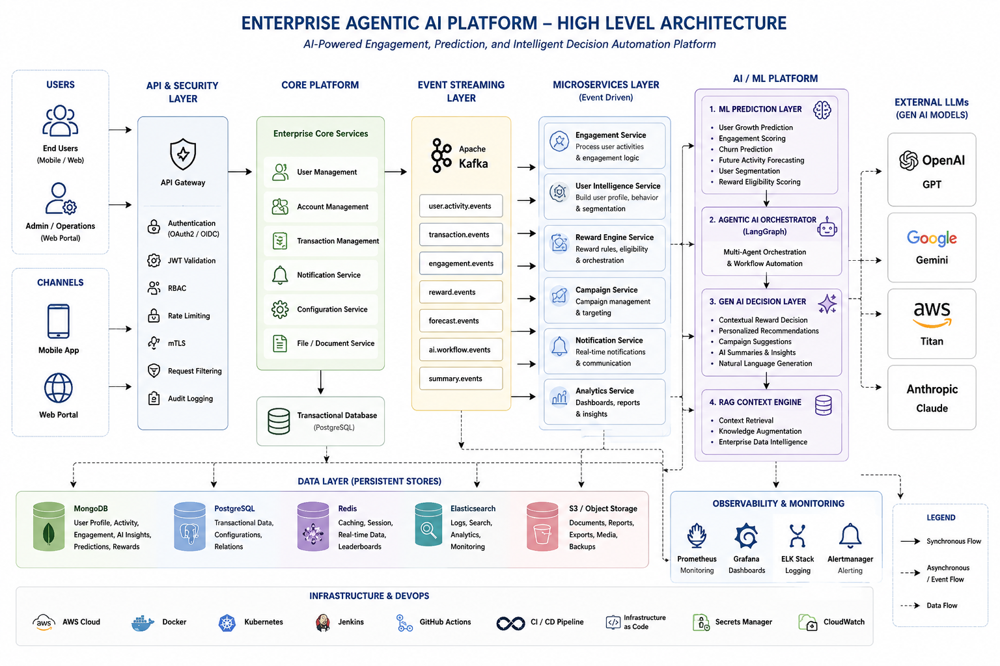
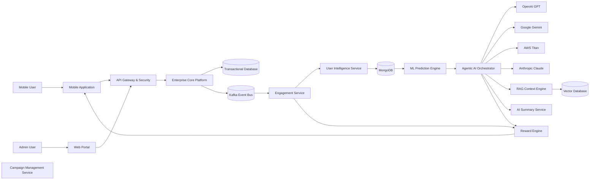
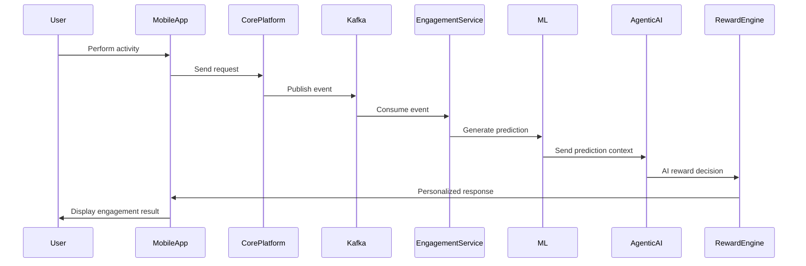
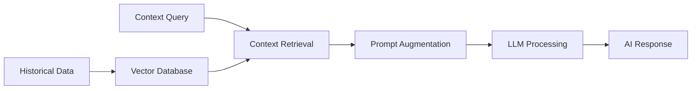

# 🚀 Enterprise Agentic AI Platform

> AI-Powered Enterprise Engagement, Forecasting & Intelligent Decision Automation Platform



---

# 📌 Project Overview

Enterprise Agentic AI Platform is a cloud-native, event-driven, AI-enabled enterprise architecture designed for:

- Intelligent user engagement
- AI-driven personalization
- Predictive forecasting
- Autonomous reward orchestration
- Real-time event processing
- Context-aware AI workflows
- Enterprise-scale AI governance

The platform combines:

✅ Machine Learning (ML)  
✅ Generative AI (GenAI)  
✅ Agentic AI  
✅ RAG Architecture  
✅ Kafka Event Streaming  
✅ Enterprise Microservices  

to create a scalable and intelligent enterprise ecosystem.

---

# 🎯 Business Objectives

The platform is designed to solve enterprise challenges such as:

- Low user engagement
- Static campaign targeting
- Non-personalized rewards
- Limited forecasting capabilities
- Delayed operational insights
- Manual campaign optimization

The solution enables:

- AI-powered personalization
- Predictive engagement
- Dynamic reward optimization
- Intelligent decision automation
- Real-time event orchestration
- AI-assisted enterprise operations

---

# 🧠 AI Architecture Strategy

The platform follows a hybrid AI architecture:

| AI Layer | Responsibility |
|---|---|
| Machine Learning | Prediction & forecasting |
| Generative AI | Contextual reward decisions |
| Agentic AI | Workflow orchestration |
| RAG | Context retrieval & AI intelligence |

---

# 📈 Machine Learning Prediction Layer

Machine Learning models are responsible for:

- User growth prediction
- Engagement scoring
- Churn probability analysis
- Future activity forecasting
- User segmentation
- Reward eligibility prediction

ML models analyze:

- Historical user activity
- Behavioral trends
- Usage frequency
- Growth patterns
- Seasonal trends
- Transaction history

ML outputs include:

```text
- Predicted user value
- Growth probability
- Engagement score
- Risk category
- Forecasted activity trend
```

---

# 🤖 Generative AI Decision Layer

Generative AI models are used for:

- Intelligent reward decisions
- Personalized engagement journeys
- AI-generated recommendations
- AI summaries & insights
- Dynamic campaign targeting
- Human-like contextual reasoning

Supported LLM providers:

- OpenAI GPT
- Google Gemini
- AWS Titan
- Anthropic Claude

GenAI uses:

- ML prediction outputs
- User history
- Engagement context
- Business rules
- Reward history
- Campaign objectives

to generate intelligent recommendations.

---

# 🏗 High-Level Architecture



---

# 🔄 Real-Time Event Flow



---

# 🧠 Agentic AI Orchestration

The platform uses multi-agent orchestration for enterprise AI workflows.

---

# 🤖 AI Agents

| AI Agent | Responsibility |
|---|---|
| User Behavior Agent | Analyze activity patterns |
| Forecast Agent | Predict future growth |
| Reward Optimization Agent | Intelligent reward decisions |
| Campaign Recommendation Agent | Personalized targeting |
| AI Summary Agent | Generate insights & summaries |
| Governance Agent | Validate AI policy compliance |

---

# 📊 User Intelligence Layer

MongoDB stores:

- User activity history
- Engagement trends
- AI-generated insights
- Personalized preferences
- Reward history
- Forecast values
- Behavioral analytics
- AI recommendations

---

# ⚡ Kafka Event Streaming

Kafka enables:

- Real-time event processing
- Event replay capability
- Scalable AI workflows
- Loose coupling
- High throughput orchestration

Kafka topics include:

```text
user.activity.events
reward.events
engagement.events
forecast.events
ai.workflow.events
summary.events
```

---

# 🧠 RAG Architecture

The RAG layer enables contextual enterprise AI.

Capabilities:

- Context-aware AI responses
- Historical behavior analysis
- Intelligent recommendations
- Enterprise knowledge retrieval
- AI-enhanced summaries

---

# 🔄 RAG Workflow



---

# 🔐 Security & Governance

Enterprise-grade security implementation includes:

- OAuth2
- JWT Authentication
- RBAC
- OIDC
- mTLS
- Audit logging
- AI governance controls
- Prompt validation
- Secure API Gateway
- Compliance monitoring

---

# ☁ Cloud & Infrastructure

| Layer | Technology |
|---|---|
| Backend | Java, Spring Boot |
| Event Streaming | Kafka |
| AI Orchestration | LangGraph |
| Databases | MongoDB, PostgreSQL |
| Cloud | AWS |
| LLM Providers | GPT, Gemini, Titan, Claude |
| APIs | REST APIs |
| Monitoring | ELK Stack, Kibana |
| CI/CD | Jenkins, GitHub Actions |

---

# 📈 Business Benefits

The platform delivers:

✅ AI-powered personalization  
✅ Intelligent engagement optimization  
✅ Predictive analytics  
✅ Dynamic reward orchestration  
✅ Real-time event processing  
✅ Enterprise scalability  
✅ AI-assisted operations  
✅ Context-aware automation  

---

# 🧩 Example AI Decision Flow

## Example Scenario

Machine Learning predicts:

```text
User has:
- High growth probability
- Increasing engagement trend
- Strong retention behavior
```

Generative AI decides:

```text
- Premium cashback eligibility
- Personalized campaign recommendation
- Enhanced reward points
- Smart engagement journey
```

---

# 🔮 Future Enhancements

Planned future capabilities include:

- Reinforcement learning reward engine
- AI anomaly detection
- Conversational AI assistant
- Voice-based AI workflows
- Autonomous campaign optimization
- AI explainability dashboards
- AI-powered fraud analytics

---

# 👨‍💻 About

Technical Product Owner with enterprise experience across:

- AI Platforms
- Agentic AI
- Fintech Systems
- Event-Driven Architecture
- Enterprise Microservices
- AI Governance
- Cloud-Native Platforms

Specialized in designing scalable AI-enabled enterprise systems integrating:

- ML forecasting
- GenAI orchestration
- Multi-agent AI workflows
- Kafka streaming
- Enterprise personalization

---

# ⭐ Vision

Building secure, scalable, and intelligent enterprise AI systems that combine:

- Human intelligence
- Agentic AI orchestration
- Predictive analytics
- Real-time automation
- Context-aware AI
- Enterprise-grade governance

to create the next generation of intelligent enterprise platforms.
