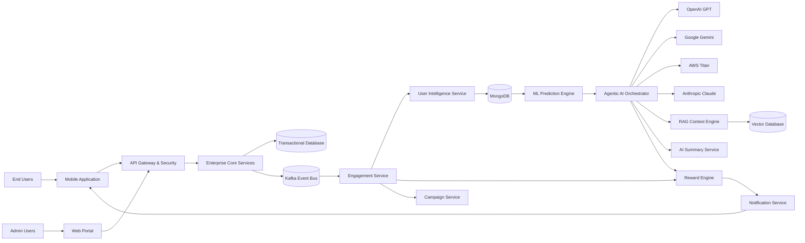
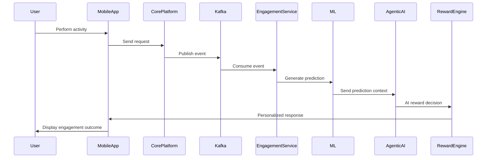
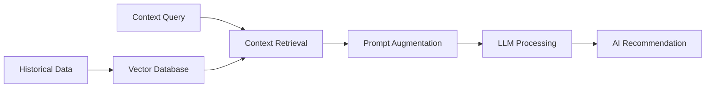

# 🚀 Enterprise Agentic AI Platform


> AI-Powered Enterprise Engagement, Forecasting & Intelligent Decision Automation Platform

---

# 🏗 Enterprise Architecture

<p align="center">
  
</p>

---

# 📌 Project Overview

Enterprise Agentic AI Platform is a cloud-native, event-driven, AI-enabled enterprise architecture designed for:

- Intelligent user engagement
- AI-driven personalization
- Predictive forecasting
- Autonomous decision orchestration
- Real-time event processing
- Context-aware AI workflows
- Enterprise AI governance

The platform combines:

✅ Machine Learning (ML)  
✅ Generative AI (GenAI)  
✅ Agentic AI  
✅ RAG (Retrieval-Augmented Generation)  
✅ Kafka Event Streaming  
✅ Enterprise Microservices  

to create scalable and intelligent enterprise systems.

---

# 🎯 Key Business Objectives

The platform addresses enterprise challenges such as:

- Low user engagement
- Static campaign targeting
- Delayed operational insights
- Non-personalized experiences
- Manual reward orchestration
- Limited forecasting capabilities

The solution enables:

- AI-powered personalization
- Dynamic reward orchestration
- Intelligent forecasting
- Real-time event processing
- Predictive engagement
- Autonomous workflow automation

---

# 🧠 AI Architecture Strategy

The platform follows a hybrid AI architecture model.

| AI Layer | Responsibility |
|---|---|
| Machine Learning | Prediction & forecasting |
| Generative AI | Contextual reward decisions |
| Agentic AI | Workflow orchestration |
| RAG Engine | Context retrieval & enterprise intelligence |

---

# 📈 Machine Learning Prediction Layer

Machine Learning models are responsible for:

- User growth prediction
- Engagement scoring
- Churn probability analysis
- Forecasting future activity
- User segmentation
- Reward eligibility scoring

ML models analyze:

- Historical activity
- Behavioral trends
- Usage frequency
- Growth patterns
- Seasonal behavior
- Event history

ML output examples:

```text
- Predicted user value
- Future growth probability
- Risk score
- Engagement category
- Forecasted activity trend
```

---

# 🤖 Generative AI Decision Layer

Generative AI models are responsible for:

- Intelligent reward orchestration
- Personalized recommendations
- Dynamic campaign targeting
- AI-generated summaries
- Context-aware engagement
- Human-like reasoning workflows

Supported GenAI providers:

- OpenAI GPT
- Google Gemini
- AWS Titan
- Anthropic Claude

The GenAI layer uses:

- ML prediction outputs
- User history
- Business context
- Reward history
- Engagement analytics
- Campaign objectives

to generate intelligent recommendations.

---

# 🏗 High-Level Architecture Flow



---

# 🔄 Real-Time Event Processing Flow



---

# 🤖 AI Agents

| AI Agent | Responsibility |
|---|---|
| User Behavior Agent | Analyze activity patterns |
| Forecast Agent | Predict future growth |
| Reward Optimization Agent | Intelligent reward selection |
| Campaign Recommendation Agent | Personalized targeting |
| AI Summary Agent | Generate insights & summaries |
| Governance Agent | Validate AI policy compliance |

---

# ⚡ Kafka Event Streaming

Kafka enables:

- Real-time event processing
- Event replay capability
- AI-triggered workflows
- Loose coupling
- High throughput orchestration
- Scalable microservices communication

Kafka topics include:

```text
user.activity.events
reward.events
engagement.events
forecast.events
ai.workflow.events
summary.events
```

---

# 🧠 RAG Architecture

The RAG layer enables:

- Context-aware AI responses
- Historical behavior analysis
- Enterprise knowledge retrieval
- Personalized recommendations
- AI-enhanced operational insights

---

# 🔄 RAG Workflow



---

# 📊 User Intelligence Layer

MongoDB stores:

- User activity history
- Engagement metrics
- AI-generated insights
- Reward history
- Personalized preferences
- Forecast values
- Growth trends
- Behavioral analytics

---

# 🔐 Security & Governance

Enterprise-grade security implementation includes:

- OAuth2
- JWT Authentication
- RBAC
- OIDC
- mTLS
- Audit logging
- AI governance controls
- Prompt validation
- Secure API Gateway
- Compliance monitoring

---

# ☁ Technology Stack

| Layer | Technology |
|---|---|
| Backend | Java, Spring Boot |
| Event Streaming | Apache Kafka |
| AI Orchestration | LangGraph |
| Databases | MongoDB, PostgreSQL |
| Cloud | AWS |
| GenAI Providers | GPT, Gemini, Titan, Claude |
| APIs | REST APIs |
| Monitoring | ELK Stack, Kibana |
| CI/CD | Jenkins, GitHub Actions |

---

# 📈 Business Benefits

The platform delivers:

✅ AI-powered personalization  
✅ Predictive engagement  
✅ Intelligent reward orchestration  
✅ Dynamic campaign targeting  
✅ Real-time event processing  
✅ Enterprise scalability  
✅ AI-assisted operations  
✅ Context-aware automation  

---

# 🧩 Example AI Decision Flow

## Example Scenario

Machine Learning predicts:

```text
User has:
- High growth probability
- Strong engagement trend
- Increasing activity behavior
```

Generative AI decides:

```text
- Premium cashback eligibility
- Personalized campaign recommendation
- Enhanced reward points
- Smart engagement journey
```

---

# 🔮 Future Enhancements

Planned future capabilities include:

- Reinforcement learning reward engine
- AI anomaly detection
- Conversational AI assistant
- Voice AI workflows
- Autonomous campaign optimization
- AI explainability dashboards
- AI-powered fraud analytics

---

# 📂 Repository Structure

```text
enterprise-agentic-ai-platform/
│
├── README.md
│
├── architecture/
│   ├── high-level-architecture.png
│   ├── kafka-event-flow.png
│   ├── rag-workflow.png
│
├── workflows/
│   ├── user-engagement-flow.md
│   ├── reward-decision-flow.md
│   ├── forecast-engine-flow.md
│
├── ai-agents/
│   ├── reward-agent.md
│   ├── forecast-agent.md
│   ├── recommendation-agent.md
│
├── prompts/
├── governance/
└── api-design/
```

---

# 👨‍💻 About

Technical Product Owner with enterprise experience across:

- Agentic AI
- RAG Architectures
- Enterprise AI Platforms
- Event-Driven Systems
- Cloud-Native Microservices
- AI Governance & Security
- Enterprise Payments & Fintech

Specialized in building scalable AI-enabled enterprise systems integrating:

- ML forecasting
- GenAI orchestration
- Multi-agent workflows
- Kafka streaming
- Intelligent automation

---

# ⭐ Vision

Building secure, scalable, and intelligent enterprise AI systems that combine:

- Human intelligence
- Agentic AI orchestration
- Predictive analytics
- Context-aware AI
- Real-time automation
- Enterprise-grade governance

to power the next generation of enterprise platforms.
